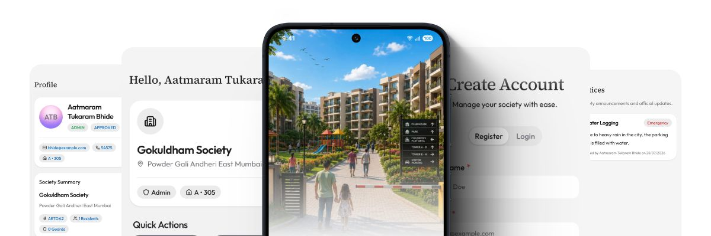
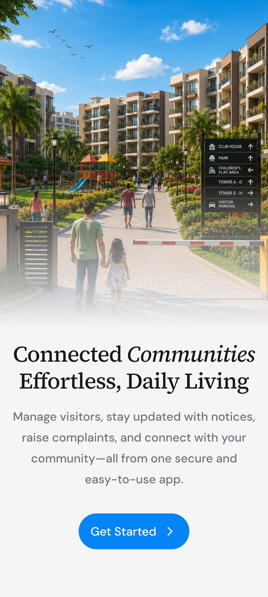
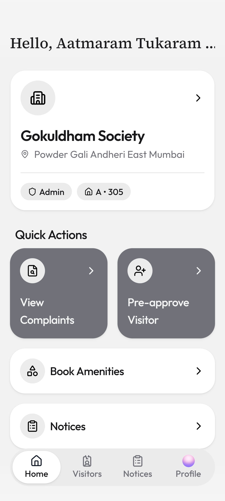
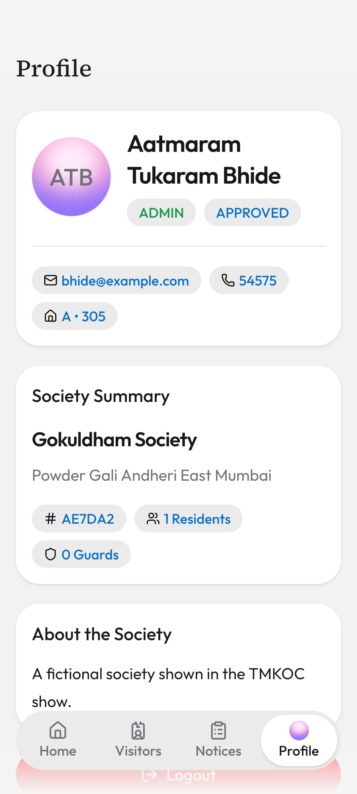

# PariSar



PariSar is a modern society management platform that streamlines communication, visitor management, maintenance, announcements, complaints, deliveries, and other day-to-day operations for residential communities.

This repository serves as the **workspace** for the PariSar project and contains both the mobile application and the backend as separate projects.

## Screenshots

<p align="center">
  
  
  
</p>

<p align="center">
  <a href="./public/preview">View more screenshots →</a>
</p>

## Demo Credentials

You can explore the app using the following demo accounts:

| Role     | Email                  | Password    |
| -------- | ---------------------- | ----------- |
| Admin    | `bhide@example.com`    | `Test@123!` |
| Resident | `jethalal@example.com` | `Test@123!` |
| Guard    | `jai@example.com`      | `Test@123!` |

> **Note:** These are demo accounts provided for testing the application.

## Project Structure

```text
.
├── backend/                  # Node.js & Express API server
│   ├── src/
│   │   ├── config/           # Database & environment configurations
│   │   ├── controllers/      # API route handlers & logic
│   │   ├── middlewares/      # Auth & request middlewares
│   │   ├── models/           # Mongoose schemas & data models
│   │   ├── routes/           # API route definitions
│   │   └── utils/            # Shared helper functions
│   ├── app.js                # Express application setup
│   ├── server.js             # Server entry point
│   └── package.json
│
├── mobile/                   # Expo & React Native application
│   ├── assets/               # App icons, splash screens & static assets
│   ├── src/
│   │   ├── app/              # Expo Router file-based screens & routes
│   │   ├── components/       # Reusable UI components
│   │   ├── lib/              # API hooks & helper utilities
│   │   └── stores/           # Global state management
│   ├── app.json              # Expo application configuration
│   └── package.json
│
├── public/                   # Media & documentation assets
│   ├── banner.jpg            # Repository banner image
│   └── preview/              # Application preview screenshots
└── README.MD                 # Project workspace documentation
```

## Projects

- **[Mobile Application](./mobile)** — Expo + React Native client
- **[Backend API](./backend)** — Express.js + MongoDB server

### Mobile ([`/mobile`](./mobile))

The React Native application built with Expo.

**Tech Stack**

- React Native
- Expo
- TypeScript
- Expo Router
- Zustand

**Responsibilities**

- Resident & Guard interfaces
- Authentication
- Visitor management
- Complaints
- Notices
- Maintenance payments
- Push notifications
- Profile & society management

---

### Backend ([`/backend`](./backend))

REST API powering the PariSar mobile application.

**Tech Stack**

- Node.js
- Express.js
- MongoDB
- Mongoose
- JWT Authentication

**Responsibilities**

- Authentication & authorization
- User and society management
- Visitor approval workflow
- Complaint management
- Notice management
- Business logic

---

## Getting Started

Clone the repository:

```bash
git clone https://github.com/pratksharma/PariSar
cd PariSar
```

### Mobile

```bash
cd mobile
npm install
npm start
```

### Backend

```bash
cd backend
npm install
npm run dev
```

## Repository Layout

Each project is intentionally isolated with its own:

- `package.json`
- `.gitignore`
- Environment configuration
- Dependencies
- Documentation

This allows the frontend and backend to be developed, tested, and deployed independently.

## License

This project is licensed under the MIT License.
